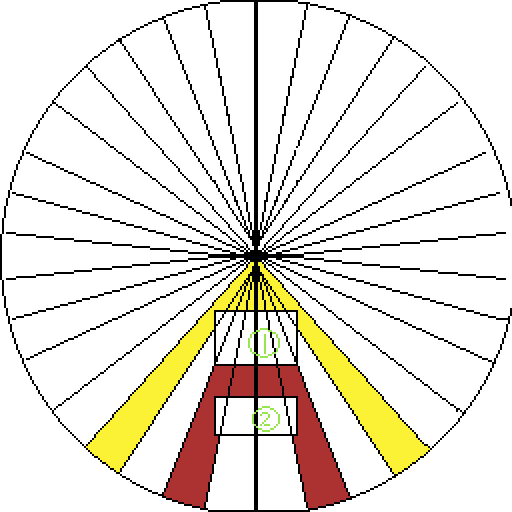

## 中文说明


# 目标排序式径向扇区爆炸

这是一个用于 2D 游戏的轻量级分层爆炸算法，主要解决普通圆形 AoE 难以表现装甲遮挡、爆炸穿透和内部模块受损的问题。

本仓库使用 Godot 4 提供可运行的参考实现，但算法思想不依赖 Godot。只要游戏引擎能够完成区域查询、碰撞几何距离计算和目标伤害调用，就可以使用相同的目标排序与扇区传播逻辑。


### 核心思路

爆炸发生时，首先执行一次圆形范围查询，取得爆炸半径内的全部碰撞形状。查询结果如果有多个碰撞形状可以为被碰撞者设置一个id放置重复命中。

每个目标根据自身碰撞几何到爆心的最近距离排序，并根据碰撞几何覆盖的角度范围映射到一个或多个 Sector（扇区）。爆炸随后按照目标距离由近到远结算。

```text
爆炸产生
↓
一次圆形范围查询
↓
按目标 ID 合并 Collision Shape
↓
计算目标到爆心的最近几何距离
↓
计算目标覆盖的 Sector
↓
目标按照距离从近到远排序
↓
使用对应 Sector 的剩余伤害进行结算
↓
目标存活 → 阻挡对应 Sector
目标摧毁 → Sector 保留剩余能量并继续向后传播
```

每个 Sector 都拥有独立的 Damage Pool，并根据爆炸传播距离产生伤害衰减。多个 Sector 可以同时命中同一个目标，结算目标时可以合并这些 Sector 的可用伤害，但消耗量会按比例返回各自的 Sector。

剩余能量不会从一个 Sector 转移到另一个 Sector。这样可以保留局部装甲保护、方向性遮挡和结构被摧毁后的穿透效果。

### 我的实现方式：Godot 4 参考实现

当前仓库中的实现使用 Godot 4 二维物理接口：

1. 使用一个圆形 `PhysicsShapeQueryParameters2D` 执行一次物理空间广域查询。
2. 将返回的多个碰撞 Shape 按 Gameplay Target 的实例 ID 合并。
3. 使用扩张圆与真实 `Shape2D` 进行二分接触测试，计算碰撞几何到爆心的最近距离，而不是使用节点中心距离。
4. 读取碰撞形状边界点相对爆心的角度，求出目标覆盖的 Sector 集合。
5. 将目标按照最近几何距离由近到远排序。
6. 每个 Sector 独立记录初始伤害、剩余伤害、当前传播距离和阻挡状态。
7. 同一目标覆盖多个 Sector 时，先汇总这些 Sector 的可用伤害，再按照各 Sector 的贡献比例扣除实际消耗。
8. 目标存活时阻挡参与本次结算的 Sector；目标被摧毁时，这些 Sector 使用剩余能量继续处理后方目标。

这里的“一次查询”是指每次爆炸只进行一次物理空间广域查询。取得候选碰撞体以后，最近距离和 Sector 覆盖范围由内存中的几何计算完成。

演示目标通过以下方法与求解器交互：

```gdscript
func get_explosion_target() -> Object
func is_explosion_target_available() -> bool
func get_explosion_health() -> float
func get_explosion_damage_modifier() -> float
func receive_explosion_damage(amount: float) -> float
func does_explosion_target_block() -> bool
```

这些方法只是当前 Godot 参考实现采用的目标接口。正式项目可以把它们替换为自己的生命值、护盾、装甲、模块或角色接口。

### 其他引擎可能采用的实现方式

其他引擎不需要复制 Godot 的节点或类结构，只需要为算法提供相同含义的基础能力：
具体由各自引擎提供的接口判断。

不同引擎可以使用自己的区域重叠查询、最近点、距离检测、形状投影或多边形接口完成这些步骤。接口名称和碰撞系统可以不同，但后续逻辑保持一致：

```text
候选碰撞体
→ 合并为游戏目标
→ 计算距离和扇区覆盖
→ 按距离排序
→ 独立推进每个扇区的伤害池
→ 根据目标存活状态决定阻挡或穿透
```


同样的思想也可以扩展到 3D。二维圆形 Sector 可以替换为空间方向上的锥形或球面分区，目标仍然按照几何距离排序，并独立消耗对应方向分区的能量。

### 概念图说明



图中的目标 1 距离爆心更近，因此先结算其覆盖的 Sector。黄色区域表示这些 Sector 从爆心推进到目标 1 的距离区段。

如果目标 1 在结算后仍然存活，它会阻挡自身覆盖的 Sector，后方目标 2 不会再从这些方向受到伤害。如果目标 1 被摧毁，对应 Sector 会保留尚未消耗的能量，并从目标 1 所在距离继续向目标 2 推进。后续区段使用另一种颜色表示。

目标 1 只阻挡自己实际覆盖的 Sector，不会把其他方向的爆炸能量转移或一并清除。

### Sector Density 与伤害含义

Sector Density 决定角度分辨率。密度越高，细小目标和局部遮挡的表达越精细；密度越低，结果越粗略，但计算量也更低。

当前参考实现中的输入值是 `damage_per_sector`，表示每个 Sector 的初始伤害。因此增加 Sector 数量也会增加整个爆炸的理论总伤害池：

```text
理论总伤害池 = Sector Count × Damage Per Sector
```

如果项目希望 Sector Density 只影响精度而不改变总伤害，可以在调用求解器前进行换算：

```text
Damage Per Sector = Total Explosion Damage / Sector Count
```

### 当前几何近似

当前实现适合矩形、圆形、胶囊、线段和普通凸多边形。对于复杂凹形结构或相互分离的多个 Shape，连续角度覆盖可能包含一定近似误差。

需要更高精度时，可以拆分复杂形状、提高 Sector Density，或者针对具体引擎增加更精确的多边形与角度区间计算。

### 运行项目

1. 使用 Godot 4.7 或更高版本打开仓库目录。
2. 运行 `main.tscn` 或直接运行项目。
3. 从右侧选择目标形状并在中央区域放置。
4. 切换到引爆模式，然后点击中央区域观察传播、阻挡与穿透。


# Target-Sorted Radial Sector Explosion

> Translated by GPT. The original algorithm concept, implementation design, and Chinese documentation were written by the author.

This is a lightweight layered explosion algorithm for 2D games. It addresses a limitation of conventional circular area damage: ordinary AoE calculations do not naturally represent armor blocking, penetration, or damage to internal components.

This repository provides a runnable Godot 4 reference implementation, but the algorithm itself is engine-independent. Any engine that can query an area, calculate the distance to collision geometry, and apply damage to a target can implement the same target-sorting and sector-propagation logic.

## Core concept

When an explosion occurs, the algorithm performs one circular range query to collect every collision shape inside the blast radius. If the query returns multiple collision shapes belonging to the same hit target, an ID can be assigned to that target to prevent duplicate hits.

Each target is sorted by the shortest distance between its collision geometry and the explosion center. Its collision geometry is also mapped to one or more angular Sectors. Damage is then resolved from the nearest target to the farthest target.

```text
Explosion
↓
One circular broad-phase query
↓
Merge collision shapes by target ID
↓
Calculate the nearest geometric distance to the explosion center
↓
Determine the Sectors covered by each target
↓
Sort targets from nearest to farthest
↓
Resolve damage from the remaining energy of those Sectors
↓
Target survives → block the participating Sectors
Target is destroyed → keep the remaining energy and continue propagating
```

Each Sector owns an independent Damage Pool. Its remaining damage decreases as it propagates away from the explosion center. Multiple Sectors may affect the same target, so their available damage can be combined for that target. The actual consumption is then deducted proportionally from the participating Sectors.

Remaining energy is never redistributed from one Sector to another. This preserves local armor protection, directional occlusion, and penetration after a structure is destroyed.

## Author's implementation: Godot 4 reference

The implementation in this repository uses the Godot 4 2D physics API:

1. A circular `PhysicsShapeQueryParameters2D` performs one broad-phase physics-space query.
2. Multiple collision Shapes are merged by the instance ID of their Gameplay Target.
3. An expanding circle performs a binary contact search against the real `Shape2D`, producing the nearest geometry distance instead of using the node-center distance.
4. Boundary-point angles are measured relative to the explosion center and mapped to a set of covered Sectors.
5. Targets are sorted from nearest to farthest by geometric distance.
6. Every Sector independently stores its initial damage, remaining damage, current propagation distance, and blocked state.
7. When one target covers several Sectors, their available damage is combined and the actual consumption is deducted proportionally from their individual pools.
8. A surviving target blocks the participating Sectors. A destroyed target allows their remaining energy to continue toward targets behind it.

“One query” means one physics-space broad-phase query per explosion. After candidate colliders are collected, nearest-distance and Sector-coverage calculations are performed as in-memory geometric operations.

Demo targets expose the following methods to the solver:

```gdscript
func get_explosion_target() -> Object
func is_explosion_target_available() -> bool
func get_explosion_health() -> float
func get_explosion_damage_modifier() -> float
func receive_explosion_damage(amount: float) -> float
func does_explosion_target_block() -> bool
```

These methods are only the target contract used by the Godot reference implementation. A production game can adapt the solver to its own health, shield, armor, module, or character interfaces.

## Possible implementations in other engines

Other engines do not need to reproduce Godot's node or class structure. The exact detection and geometry calculations are determined by the interfaces provided by each engine.

An engine may use its own overlap query, closest-point calculation, distance test, shape projection, or polygon API. The API names and collision system can differ while the rest of the algorithm remains the same:

```text
Candidate colliders
→ merge into gameplay targets
→ calculate distance and Sector coverage
→ sort by distance
→ propagate each Sector's independent damage pool
→ block or penetrate according to the target's survival state
```

The same concept can be extended to 3D. The 2D circular Sectors can become directional cones or partitions on a sphere. Targets can still be sorted by geometric distance and consume energy from independent directional regions.

## Concept diagram


Target 1 is closer to the explosion center, so its covered Sectors are resolved first. The yellow region represents the distance traveled by those Sectors from the explosion center to Target 1.

If Target 1 survives, it blocks the Sectors that overlap its geometry, preventing Target 2 from receiving damage from those directions. If Target 1 is destroyed, those Sectors retain their remaining energy and continue propagating from Target 1 toward Target 2. The following propagation interval is shown with a different color.

Target 1 blocks only the Sectors covered by its own geometry. Energy in other directions is neither transferred nor removed.

## Sector Density and damage semantics

Sector Density controls angular resolution. Higher density provides finer representation of small targets and local occlusion. Lower density produces a coarser result with less processing work.

The current reference implementation accepts `damage_per_sector`, meaning that every Sector starts with the specified damage. Increasing the Sector count therefore also increases the theoretical total damage pool:

```text
Theoretical Total Damage Pool = Sector Count × Damage Per Sector
```

If a project wants Sector Density to affect precision without changing total damage, it can convert total explosion damage before calling the solver:

```text
Damage Per Sector = Total Explosion Damage / Sector Count
```

## Current geometry approximation

The current implementation works well with rectangles, circles, capsules, segments, and ordinary convex polygons. Complex concave geometry or widely separated Shapes may introduce approximation errors when converted into one continuous angular coverage interval.

Projects that need higher accuracy can split complex geometry, increase Sector Density, or implement more precise polygon and angular-interval calculations using the host engine's geometry API.

## Running the project

1. Open the repository directory with Godot 4.7 or newer.
2. Run `main.tscn` or run the project directly.
3. Select a target shape on the right and place it in the center area.
4. Switch to explosion mode, then click the center area to observe propagation, blocking, and penetration.


## License

MIT License.
